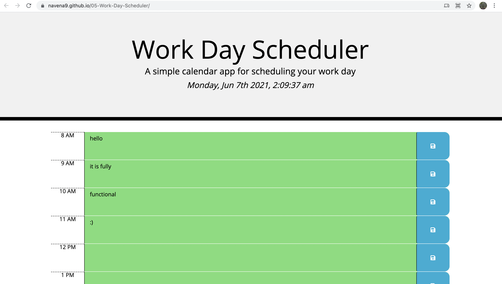

# 05 - Thitd Party API's: Work Day Scheduler

## Project 

This project consists on a simple calendar application that allows a user to save events for each hour of the day. This app runs in the browser and feature dynamically updated HTML and CSS powered by jQuery.


## User Story

As an employee with a busy schedule, I want to add important events to a daily planner so that I can manage my time effectively.


## Acceptance Criteria

```md
GIVEN I am using a daily planner to create a schedule
WHEN I open the planner
THEN the current day is displayed at the top of the calendar
WHEN I scroll down
THEN I am presented with timeblocks for standard business hours
WHEN I view the timeblocks for that day
THEN each timeblock is color coded to indicate whether it is in the past, present, or future
WHEN I click into a timeblock
THEN I can enter an event
WHEN I click the save button for that timeblock
THEN the text for that event is saved in local storage
WHEN I refresh the page
THEN the saved events persist
```


## Screen Shot

The following image shows the web application's appearance :




  
## URL 

The following animation demonstrates the application functionality:
https://navena9.github.io/05-Work-Day-Scheduler/


## Used Frameworks/Technologies

- JavaScript
- HTML
- CSS
- JQuery


### Contributor


Nicolas Cedano Avena
- - -
© 2021 Trilogy Education Services, LLC, a 2U, Inc. brand. Confidential and Proprietary. All Rights Reserved.